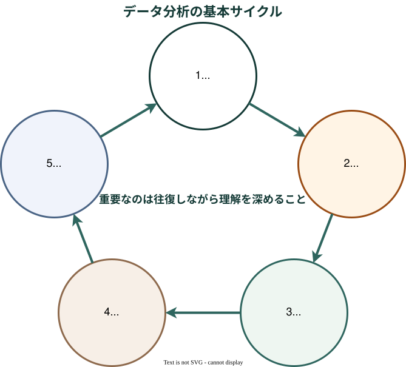
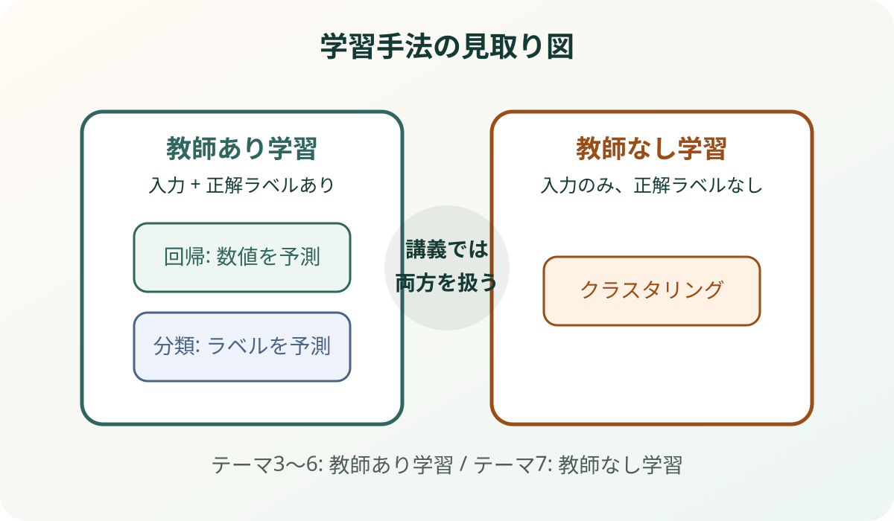

# 機械学習トレーニング
## 講義スライド

- Python基礎から発表までを15回で体験
- 可視化、回帰、分類、ニューラルネットワーク、CNN、クラスタリングを段階的に学ぶ
- AIを使っても、**結果を自分の言葉で説明できること**を重視

---

# この講義のねらい

- データ分析の基本的な流れを、手を動かしながら理解する
- 「コードを書く」だけでなく、**データを見て考える**習慣をつける
- モデルを作ったあとに、**評価して解釈する**ところまで経験する
- 最終的に、興味を持った分析結果を図・指標・考察で説明できるようになる

---

# スケジュール

1. 班分け、ガイダンス

2. テーマ1 Python基礎・導入

3. テーマ2 可視化とEDA

4. テーマ3 回帰分析 講義

5. テーマ3 回帰分析 演習

6. テーマ4 分類の基礎 講義

7. テーマ4 分類の基礎 演習

8. テーマ5 ニューラルネットワーク 講義

9. テーマ5 ニューラルネットワーク 演習

10. テーマ6 CNNによる画像分類 講義

11. テーマ6 CNNによる画像分類 演習

12. テーマ7 クラスタリング 講義

13. テーマ7 クラスタリング 演習

14. 発表準備：興味を持った分析をまとめる

15. 発表会

---

# 必要な物品

- ノートパソコン
- Google Colab または Jupyter Notebook を使える環境
- 充電器

---

# データ分析の基本サイクル

---

# 7テーマと発表の全体ロードマップ

<h3>テーマ1 Python基礎・導入</h3>

Notebook環境に慣れ、Pythonの基本操作とデータの見方を確認する。

<h3>テーマ2 可視化とEDA</h3>

分布・相関・外れ値に注目し、可視化から仮説を立てる練習をする。

<h3>テーマ3 回帰分析</h3>

数値予測の考え方を学び、予測値と実測値のずれを評価する。

<h3>テーマ4 分類の基礎</h3>

カテゴリ予測を体験し、混同行列を使って誤分類の中身を読む。

<h3>テーマ5 ニューラルネットワーク</h3>

入力層・隠れ層・出力層の考え方を学び、学習曲線と過学習を観察する。

<h3>テーマ6 CNNによる画像分類</h3>

画像データの特徴を踏まえ、CNNによる分類と誤分類例を観察する。

<h3>テーマ7 クラスタリング</h3>

ラベルなしデータのまとまりを見つけ、PCAで結果を可視化する。

<h3>まとめ・発表</h3>

これまでの分析から1つ選び、図・指標・考察を使って5分で説明する。

---

# 授業の進め方

## 講義パート

- 背景と目的を確認
- 重要な概念を直感的に理解
- 結果を見る観点を共有

## 演習パート

- Jupyter Notebookで実行
- 可視化やモデル構築を体験
- 結果を短く言語化して振り返る

> 目的は「正解を写すこと」ではなく、「なぜその結果になったか」を説明できるようになることです。

---

# 各回のミニ成果物

毎回、次のどれかを残します。

- 1つの図
- 1つの表または評価指標
- 3文程度の考察

## 例

> この散布図から、特徴量Aと目的変数には正の関係がありそうだとわかる。  
> ただし、外れ値もあるため、単純な直線だけでは説明しきれない可能性がある。  
> 次に、回帰モデルで予測できるか確認したい。

---

# テーマ1 Python基礎・データ分析入門

- Jupyter Notebook の使い方に慣れる
- Python の最小限の文法を確認する
- データを読み込み、眺め、簡単に可視化する

## キーワード

`変数` `print` `pandas` `DataFrame` `可視化` `Iris`

---

# テーマ1で身につけたいこと

- セルを実行しながら試行錯誤できる
- データの行・列が何を表しているか説明できる
- ヒストグラムや散布図を見て、簡単な傾向を言える

## 今日の成果物

- データの先頭行を確認する
- 基本統計量を見る
- グラフを1つ作り、読み取れることを1つ書く

---

# テーマ2 データ可視化とEDA

- 探索的データ分析 (EDA: Exploratory Data Analysis)は、モデル作成前の「観察」と「仮説づくり」
- 分布、相関、外れ値に注目してデータを読む
- 可視化から「効きそうな特徴量」を考える

## 使うデータ

- `Iris`

---

# EDAで何を見るか

- 分布：値はどの範囲に多いか
- 比較：グループごとに違いがあるか
- 関係：2つの特徴量に関係があるか
- 外れ値：極端に大きい・小さい値はあるか

## 今日の成果物

- グラフを2つ作る
- 読み取れることを3文でまとめる

---

# 機械学習の全体像

---

# テーマ3 回帰分析

- 回帰は、**数値を予測する問題**
- まず散布図で関係を見てからモデルを考える
- 予測値と実測値のずれを見て、モデルを評価する

## 使うデータ

- `California Housing`

---

# 回帰で見るポイント

| 観点 | 何を見るか | 例 |
| --- | --- | --- |
| 関係 | 特徴量と目的変数の関係 | 散布図、相関 |
| 誤差 | 予測のずれの大きさ | `MAE`, `RMSE` |
| 汎化性能 | 未知データで通用するか | train/test の差 |
| 解釈 | どんな失敗をしているか | 予測値と実測値の比較 |

---

# テーマ3で身につけたいこと

- 回帰が「数値予測」であることを説明できる
- train/test 分割の目的を説明できる
- 予測値と実測値のずれを評価できる
- モデルの良し悪しを、指標だけでなく図でも確認できる

## 比較する例

- 線形回帰
- 決定木
- ランダムフォレスト

---

# テーマ4 分類の基礎

- 分類は、**カテゴリを当てる問題**
- 正解率だけでなく、どの誤分類が重要かを見る
- 混同行列を使って結果を読み解く

## 使うデータ

- `Breast Cancer`

---

# 分類で見るポイント

| 観点 | 何を見るか | 例 |
| --- | --- | --- |
| 正解率 | 全体としてどれくらい当たったか | accuracy |
| 誤分類 | どのクラスを間違えたか | 混同行列 |
| 重要度 | どの間違いが問題になるか | 偽陽性、偽陰性 |
| 説明 | なぜその結果になったか | 特徴量、境界、失敗例 |

---

# テーマ4で身につけたいこと

- 回帰と分類の違いを説明できる
- 混同行列の読み方を理解する
- 正解率だけで判断しない理由を説明できる
- 誤分類の中身を見て、モデルの限界を考えられる

---

# テーマ5 ニューラルネットワークの基礎

- ニューラルネットワークは、多数の重みを使って入力と出力の関係を学習するモデル
- 入力層・隠れ層・出力層から構成される
- 学習では、予測の誤差が小さくなるように重みを更新する

## キーワード

`入力層` `隠れ層` `出力層` `重み` `活性化関数` `損失関数` `エポック`

---

# ニューラルネットワークで見るポイント

- 学習が進むと、損失は下がるか
- 訓練データとテストデータで性能に差があるか
- エポック数を増やすと、必ず良くなるのか
- 結果をどのように説明できるか

## 使うデータ

- `Breast Cancer` または `Iris`

---

# テーマ5で身につけたいこと

- ニューラルネットワークの基本構造を説明できる
- 学習曲線から学習の様子を読み取れる
- 過学習の兆候を説明できる
- CNNがニューラルネットワークの発展形であることを理解する

---

# テーマ6 CNNによる画像分類

- 画像は、空間構造を持つデータ
- CNN は画像の局所的な特徴を段階的に抽出する
- 誤分類画像を見ると、モデルの限界が見える

## 使うデータ

- 手書き数字データ

---

# CNNで見るポイント

- 画像を数値データとして扱うとはどういうことか
- 通常の表形式データと画像データは何が違うか
- 正しく分類できた画像と、間違えた画像にはどんな違いがあるか
- モデルの精度だけでなく、誤分類例から何がわかるか

---

# テーマ6で身につけたいこと

- CNNが画像分類に使われる理由を説明できる
- 学習結果を正解率だけでなく、画像例から確認できる
- 誤分類画像を見て、モデルが苦手なケースを考えられる

---

# テーマ7 クラスタリング

- クラスタリングは、**正解ラベルなしで構造を探す**
- 似たデータをまとめて眺める
- `PCA` で高次元データを見やすくする

## 使うデータ

- `Wine`

---

# クラスタリングで見るポイント

- データは自然にいくつかのまとまりに分かれるか
- クラスタごとに特徴の違いはあるか
- PCAで2次元にしたとき、どのように見えるか
- クラスタ番号に、どのような意味づけができるか

---

# 教師あり学習と教師なし学習

- 教師あり学習  
  入力と正解ラベルの組から、予測ルールを学ぶ

- 教師なし学習  
  正解ラベルなしで、データのまとまりや構造を見つける

## この講義での位置づけ

- 回帰・分類・ニューラルネットワーク・CNN: 教師あり学習
- クラスタリング: 教師なし学習

---

# 発表準備

第14回では、これまでの演習から興味を持った分析を1つ選びます。

## 新しく自由課題を始めるのではなく

- 授業で使ったデータから選ぶ
- 授業で扱った手法から選ぶ
- 図・指標・考察を整理する
- 5分で説明できる形にまとめる

---

# 発表会

- これまで学んだ内容の中から、最も興味を持った分析について発表する
- 発表時間は5分程度
- 発表資料は3〜5枚を目安とする

## 発表に入れる内容

1. 選んだテーマと理由
2. 使ったデータと手法
3. 面白いと思った図・指標・結果
4. そこから言えること
5. まだ言えないこと、限界

---

# AI活用の考え方

- AIの利用は可
- ただし、**そのコードや出力を理解すること**が前提
- 結果の意味や限界を、自分の言葉で説明する

## チェックしたいこと

- このグラフから何が読めるか
- この指標は何を表すか
- このモデルはどこで失敗しているか
- AIの出力を、そのままではなく自分で確認したか

---

# 各回で共通して大切にしたいこと

- まずデータを見る
- 可視化して傾向をつかむ
- モデルを試す
- 指標だけで終わらず、結果を解釈する
- 伝わる言葉で説明する

---

# 到達目標

- Notebook 環境で分析を進められる
- 可視化から仮説を立てられる
- 回帰・分類・ニューラルネットワーク・CNN・クラスタリングの違いを説明できる
- モデルの結果を評価し、短く考察できる
- 興味を持った分析結果を、図・指標・考察を使って説明できる

---

# まとめ

- この講義では、**分析の一連の流れ**を体験する
- 重要なのは、手法名を覚えることよりも、**結果を読んで考えること**
- 最終回では、これまでの演習から興味を持った分析を選び、自分の言葉で説明する

## 次のアクション

- テーマ1では Python と Notebook に慣れる
- わからないところは、実行しながら確認する

---

# 補足

- このスライドは `Marp` で表示する前提で作成
- 図はすべて `SVG` なので拡大しても劣化しにくい

ファイル: <code>slides/course_overview_slides.md</code>

